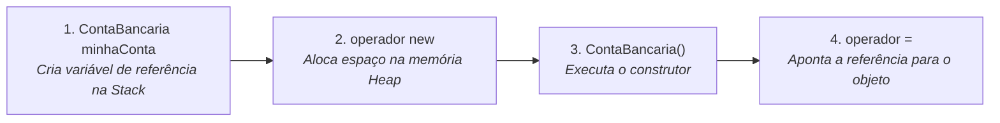

# 🛡️ Módulo 09: Encapsulamento de Dados e Modificadores de Visibilidade

**Disciplina:** Programação Orientada a Objetos (POO) em Java  
**Referência:** Baseado no material didático do **Prof. Márcio Bueno** (`Pdfs/POO_09_Encapsulamento.pdf`) e notas de aula do curso.

---

## 📌 Sumário
1. [O que é "Ser Instanciado"? (Desmistificando Objetos e Memória)](#1-o-que-é-ser-instanciado-desmistificando-objetos-e-memória)
2. [O que é Encapsulamento de Dados?](#2-o-que-é-encapsulamento-de-dados)
3. [Modificadores de Acesso / Visibilidade](#3-modificadores-de-acesso--visibilidade)
4. [A Técnica Padrão de Encapsulamento](#4-a-técnica-padrão-de-encapsulamento)
5. [Métodos de Acesso: Getters e Setters](#5-métodos-de-acesso-getters-e-setters)
6. [Exemplos Práticos e Reais](#6-exemplos-práticos-e-reais)
   - [Exemplo 1: Círculo Geométrico (Protegendo Dimensões)](#exemplo-1-círculo-geométrico-slide-do-pdf)
   - [Exemplo 2: Conta Bancária (Regras Financeiras)](#exemplo-2-conta-bancária-regras-financeiras-do-mundo-real)
7. [Exercícios do PDF Resolvidos e Comentados (Slides 17, 18 e 19)](#7-exercícios-do-pdf-resolvidos-e-comentados-slides-17-18-e-19)
   - [Classe Departamento](#classe-departamento)
   - [Classe Funcionario](#classe-funcionario)
   - [Classe Principal (Aplicação / Main)](#classe-principal-aplicacaomain)
8. [Boas Práticas e Erros Comuns](#8-boas-práticas-e-erros-comuns)

---

## 1. O que é "Ser Instanciado"? (Desmistificando Objetos e Memória)

Antes de entender como proteger os dados de uma classe, é fundamental dominar o conceito de **instanciação**.

### 🏗️ A Analogia do Molde vs. O Produto Real
* **Classe:** É apenas o **molde**, a **planta baixa** de uma casa ou a **receita de um bolo**. Ela define quais atributos (características) e métodos (comportamentos) existirão, mas ela em si **não é uma casa onde alguém pode morar**.
* **Objeto (ou Instância):** É a **casa física construída na rua**, feita a partir daquela planta.
* **Instanciar:** É o ato concreto de **criar e alocar um objeto vivo na memória do computador** a partir da sua classe.

```text
    ┌───────────────────────────┐
    │       Classe Carro        │  <-- Apenas a planta / modelo conceitual
    │  - modelo, cor, velocidade│      (Existe no arquivo .java / .class)
    └─────────────┬─────────────┘
                  │  new Carro("Civic", "Preto");  (INSTANCIAÇÃO)
                  ▼
    ┌───────────────────────────┐
    │     Objeto na Memória     │  <-- Uma INSTÂNCIA real ocupando bytes
    │  [modelo="Civic", ...]    │      na memória RAM (Heap)
    └───────────────────────────┘
```

### 🧠 O que acontece no código e na memória?

Considere a seguinte linha em Java:

```java
ContaBancaria minhaConta = new ContaBancaria();
```

Essa única linha realiza 4 operações fundamentais:



1. `ContaBancaria minhaConta`: Cria uma variável de referência na memória de execução rápida (**Stack**).
2. `new`: Pede ao sistema operacional um pedaço de memória dinâmica (**Heap**) para guardar os dados da nova conta.
3. `ContaBancaria()`: Invoca o método **construtor**, inicializando os atributos do objeto recém-nascido.
4. `=`: Guarda o endereço de memória desse novo objeto dentro da variável `minhaConta`.

> [!NOTE]
> Quando dizemos que **"uma classe pode ser instanciada por outra"**, significa que outras partes do código têm autorização e visibilidade para executar a instrução `new NomeDaClasse()`.

---

## 2. O que é Encapsulamento de Dados?

> **Definição:** Encapsulamento (*Information Hiding* ou Ocultação de Informação) é o princípio de POO que consiste em **esconder os detalhes internos de implementação e o estado de um objeto**, permitindo que ele seja manipulado **apenas através de operações controladas e seguras** (métodos públicos).

### 💊 A Metáfora da Cápsula de Remédio
Pense em uma cápsula medicinal:
* Os compostos químicos ativos (atributos) ficam guardados com segurança dentro da cápsula.
* O paciente não precisa (e nem deve!) abrir a cápsula para manipular os pós químicos manualmente. Ele apenas ingere o medicamento pela forma indicada (método público).

### 🏧 A Metáfora do Caixa Eletrônico
* Você não entra dentro do cofre do banco para pegar o dinheiro direto da gaveta (`conta.saldo = 50000`).
* Você interage com a tela: insere seu cartão, digita a senha e solicita `conta.sacar(200)`.
* O sistema do banco valida se você tem saldo, se a nota está disponível e se o limite diário permite. **Isso é encapsulamento!**

### 🎯 Por que encapsular?
1. **Proteção contra estados inválidos:** Evita que variáveis recebam valores absurdos (ex: raio de círculo negativo, saldo adulterado, idade de -50 anos).
2. **Redução de acoplamento:** Se a forma de calcular ou armazenar um dado mudar, o restante do sistema que usa o objeto não quebra.
3. **Controle de permissão:** Permite criar atributos que são *apenas leitura* (têm apenas `get`), *apenas escrita* (têm apenas `set`) ou protegidos por regras de negócio.

---

## 3. Modificadores de Acesso / Visibilidade

Em Java, os **modificadores de acesso** determinam quem pode enxergar e invocar classes, atributos, métodos e construtores.

| Modificador | Símbolo UML | Mesma Classe | Mesmo Pacote (`package`) | Subclasse em Outro Pacote | Qualquer Outro Pacote |
| :--- | :---: | :---: | :---: | :---: | :---: |
| `public` | `+` | ✅ Sim | ✅ Sim | ✅ Sim | ✅ Sim |
| `protected` | `#` | ✅ Sim | ✅ Sim | ✅ Sim (via herança) | ❌ Não |
| *Default* *(sem modificador / package-private / friendly)* | `~` | ✅ Sim | ✅ Sim | ❌ Não | ❌ Não |
| `private` | `-` | ✅ Sim | ❌ Não | ❌ Não | ❌ Não |

---

### Detalhamento de Cada Nível:

#### 1. `public` (Acesso Total)
* O membro pode ser acessado de **qualquer lugar** da aplicação.
* Ideal para métodos que formam a interface pública do objeto (ex: `depositar()`, `calcularArea()`, `getNome()`).

#### 2. `protected` (Herança e Pacote)
* O membro é acessível por classes do **mesmo pacote** e por **subclasses** (filhas), mesmo que essas subclasses estejam em outros pacotes.

#### 3. *Default* / Padrão (Amigável / *Package-Private*)
* Ocorre quando você **não coloca nenhuma palavra-chave** antes do tipo.
* O membro só pode ser acessado por classes que estão **exatamente no mesmo pacote** (`package`). Para o mundo exterior, ele é invisível.

#### 4. `private` (Acesso Restrito / Confidencial)
* O membro só pode ser lido ou alterado por código que está **dentro da própria classe**.
* Nenhuma outra classe (nem filhas, nem do mesmo pacote) pode acessá-lo diretamente.
* **É a base do encapsulamento para atributos!**

---

## 4. A Técnica Padrão de Encapsulamento

Para implementar encapsulamento robusto em Java, seguimos a convenção:

```text
┌─────────────────────────────────────────────────────────────┐
│                      CLASSE ENCAPSULADA                     │
│                                                             │
│   🔒 Atributos:  SEMPRE declarados como PRIVATE             │
│   🚪 Construtores: PÚBLICOS (para permitir instanciação)    │
│   🔑 Métodos:    PÚBLICOS com validações (Getters e Setters)│
│                                                             │
└─────────────────────────────────────────────────────────────┘
```

```java
public class ExemploPadrao {
    // 1. Atributos privados (ninguém de fora toca direto)
    private String identificador;
    private double valor;

    // 2. Construtor público (reutiliza os setters para validar)
    public ExemploPadrao(String identificador, double valor) {
        this.setIdentificador(identificador);
        this.setValor(valor);
    }

    // 3. Getters e Setters públicos com validações
    public String getIdentificador() {
        return this.identificador;
    }

    public void setIdentificador(String identificador) {
        if (identificador != null && !identificador.trim().isEmpty()) {
            this.identificador = identificador;
        }
    }

    public double getValor() {
        return this.valor;
    }

    public void setValor(double valor) {
        if (valor >= 0) {
            this.valor = valor;
        }
    }
}
```

---

## 5. Métodos de Acesso: Getters e Setters

Os métodos `get` (obter) e `set` (definir) são a porta de entrada e saída controlada dos atributos privados.

### Padrão de Nomenclatura (JavaBeans)

1. **Para obter um valor (`Getter`):**
   ```java
   public TipoDoAtributo getNomeDoAtributo() {
       return this.nomeDoAtributo;
   }
   ```

2. **Para obter um valor booleano (`is` ou `get`):**
   ```java
   public boolean isAtivo() {
       return this.ativo;
   }
   ```

3. **Para alterar um valor com validação (`Setter`):**
   ```java
   public void setNomeDoAtributo(TipoDoAtributo novoValor) {
       // Regras de validação antes de atribuir!
       if (novoValorEhValido) {
           this.nomeDoAtributo = novoValor;
       }
   }
   ```

> [!TIP]
> **Dica de Ouro:** Não crie setters "cegos" que apenas fazem `this.x = x` sem pensar. O grande poder do `set` é **impedir dados corrompidos** no seu sistema!

---

## 6. Exemplos Práticos e Reais

### Exemplo 1: Círculo Geométrico (Slide do PDF)

Imagine o que acontece se o raio de um círculo puder ser negativo:

#### ❌ Código SEM Encapsulamento (Inseguro)
```java
public class CirculoInseguro {
    public double raio; // ⚠️ PÚBLICO: qualquer um altera livremente
}

// No Main:
CirculoInseguro c = new CirculoInseguro();
c.raio = -50.0; // 💥 Aberração matemática! Raio negativo não existe!
```

#### ✅ Código COM Encapsulamento (Robusto e Seguro)
```java
package Assuntos.a09Encapsulamento.exemplos;

public class Circulo {
    // 🔒 Atributo encapsulado
    private double raio;

    // Construtor padrão
    public Circulo() {
        this.setRaio(2.0); // Valor padrão seguro
    }

    // Construtor parametrizado
    public Circulo(double raio) {
        this.setRaio(raio); // Reutiliza a validação do setter
    }

    // Getter
    public double getRaio() {
        return this.raio;
    }

    // Setter com regra de negócio
    public void setRaio(double raio) {
        if (raio > 0) {
            this.raio = raio;
        } else {
            System.out.println("⚠️ Erro: O raio deve ser estritamente positivo (> 0). Valor ignorado.");
        }
    }

    // Métodos de cálculo baseados no estado consistente
    public double calcularArea() {
        return Math.PI * this.raio * this.raio;
    }

    public double calcularComprimento() {
        return 2 * Math.PI * this.raio;
    }
}
```

---

### Exemplo 2: Conta Bancária (Regras Financeiras do Mundo Real)

```java
package Assuntos.a09Encapsulamento.exemplos;

public class ContaBancaria {
    private String titular;
    private String numeroConta;
    private double saldo; // 🔒 Saldo JAMAIS deve ser alterado diretamente de fora

    public ContaBancaria(String titular, String numeroConta, double saldoInicial) {
        this.setTitular(titular);
        this.numeroConta = numeroConta;
        this.depositar(saldoInicial); // Garante que começa com valor válido
    }

    // Operação segura: Depósito
    public void depositar(double valor) {
        if (valor > 0) {
            this.saldo += valor;
            System.out.println("✅ Depósito de R$ " + valor + " realizado com sucesso.");
        } else {
            System.out.println("❌ Valor de depósito inválido: " + valor);
        }
    }

    // Operação segura: Saque
    public boolean sacar(double valor) {
        if (valor <= 0) {
            System.out.println("❌ O valor do saque deve ser positivo.");
            return false;
        }
        if (valor > this.saldo) {
            System.out.println("❌ Saldo insuficiente para sacar R$ " + valor + ". Saldo atual: R$ " + this.saldo);
            return false;
        }
        this.saldo -= valor;
        System.out.println("✅ Saque de R$ " + valor + " concluído. Novo saldo: R$ " + this.saldo);
        return true;
    }

    // Saldo tem apenas GETTER (não existe setSaldo, para ninguém injetar dinheiro falso!)
    public double getSaldo() {
        return this.saldo;
    }

    public String getTitular() {
        return this.titular;
    }

    public void setTitular(String titular) {
        if (titular != null && !titular.trim().isEmpty()) {
            this.titular = titular;
        }
    }

    public String getNumeroConta() {
        return this.numeroConta;
    }
}
```

---

## 7. Exercícios do PDF Resolvidos e Comentados (Slides 17, 18 e 19)

O material didático do curso propõe a modelagem das classes `Departamento` e `Funcionario`, integrando encapsulamento rigoroso e associação entre objetos.

### Classe Departamento
*(Especificações do Slide 17)*:
- `codigo` (`int`): não pode ser `< 0`.
- `nome` (`String`): não pode ser nulo nem vazio.
- Getters, Setters, Construtor completo e método `toString()`.

```java
package Assuntos.a09Encapsulamento.exercicioPdf;

public class Departamento {
    private int codigo;
    private String nome;

    public Departamento(int codigo, String nome) {
        this.setCodigo(codigo);
        this.setNome(nome);
    }

    public int getCodigo() {
        return this.codigo;
    }

    public void setCodigo(int codigo) {
        if (codigo >= 0) {
            this.codigo = codigo;
        } else {
            System.out.println("⚠️ Código de departamento inválido (não pode ser negativo).");
        }
    }

    public String getNome() {
        return this.nome;
    }

    public void setNome(String nome) {
        if (nome != null && !nome.trim().isEmpty()) {
            this.nome = nome;
        } else {
            System.out.println("⚠️ Nome de departamento inválido (não pode ser nulo ou vazio).");
        }
    }

    @Override
    public String toString() {
        return "Departamento [Código: " + this.codigo + ", Nome: \"" + this.nome + "\"]";
    }
}
```

---

### Classe Funcionario
*(Especificações do Slide 18)*:
- `matricula` (`int`): não pode ser `< 0`.
- `nome` (`String`): não pode ser nulo nem vazio.
- `depto` (`Departamento`): não pode ser nulo.
- Getters, Setters, Construtor completo e método `toString()`.

```java
package Assuntos.a09Encapsulamento.exercicioPdf;

public class Funcionario {
    private int matricula;
    private String nome;
    private Departamento depto;

    public Funcionario(int matricula, String nome, Departamento depto) {
        this.setMatricula(matricula);
        this.setNome(nome);
        this.setDepto(depto);
    }

    public int getMatricula() {
        return this.matricula;
    }

    public void setMatricula(int matricula) {
        if (matricula >= 0) {
            this.matricula = matricula;
        } else {
            System.out.println("⚠️ Matrícula inválida (não pode ser negativa).");
        }
    }

    public String getNome() {
        return this.nome;
    }

    public void setNome(String nome) {
        if (nome != null && !nome.trim().isEmpty()) {
            this.nome = nome;
        } else {
            System.out.println("⚠️ Nome de funcionário inválido (não pode ser nulo ou vazio).");
        }
    }

    public Departamento getDepto() {
        return this.depto;
    }

    public void setDepto(Departamento depto) {
        if (depto != null) {
            this.depto = depto;
        } else {
            System.out.println("⚠️ Departamento não pode ser nulo.");
        }
    }

    @Override
    public String toString() {
        return "Funcionario [Matrícula: " + this.matricula + 
               ", Nome: \"" + this.nome + "\", " + 
               (this.depto != null ? this.depto.toString() : "Sem Departamento") + "]";
    }
}
```

---

### Classe Principal (Aplicação/Main)
*(Especificações do Slide 19)*:

```java
package Assuntos.a09Encapsulamento.exercicioPdf;

import java.util.Scanner;

public class Aplicacao {
    public static void main(String[] args) {
        Scanner scanner = new Scanner(System.in);

        System.out.println("=== Cadastro de Departamento ===");
        System.out.print("Informe o código do departamento: ");
        int codDepto = Integer.parseInt(scanner.nextLine());

        System.out.print("Informe o nome do departamento: ");
        String nomeDepto = scanner.nextLine();

        Departamento depto = new Departamento(codDepto, nomeDepto);

        System.out.println("\n=== Cadastro de Funcionário ===");
        System.out.print("Informe a matrícula do funcionário: ");
        int matricula = Integer.parseInt(scanner.nextLine());

        System.out.print("Informe o nome do funcionário: ");
        String nomeFunc = scanner.nextLine();

        Funcionario func = new Funcionario(matricula, nomeFunc, depto);

        System.out.println("\n=== Dados Cadastrados com Sucesso ===");
        System.out.println(func);

        scanner.close();
    }
}
```

---

## 8. Boas Práticas e Erros Comuns

| ❌ Erro Comum | ✅ Prática Recomendada |
| :--- | :--- |
| Deixar atributos como `public` para facilitar o acesso. | Deixar atributos **`private`** e fornecer métodos de acesso controlados. |
| Gerar Getters e Setters automáticos para **todos** os atributos sem critério. | Avaliar se o atributo deve ser modificado de fora. Atributos calculados ou críticos não devem ter `set`. |
| Construtor atribuindo direto aos atributos (`this.x = x`) sem validar. | Chamar os próprios **setters dentro do construtor** (`this.setX(x)`) para centralizar a lógica de validação. |
| Esquecer de verificar referências `null` ao receber objetos nos setters. | Sempre verificar se objetos passados como parâmetro são diferentes de `null` antes de associar. |

---
*Material elaborado para estudo prático de Programação Orientada a Objetos em Java.*
